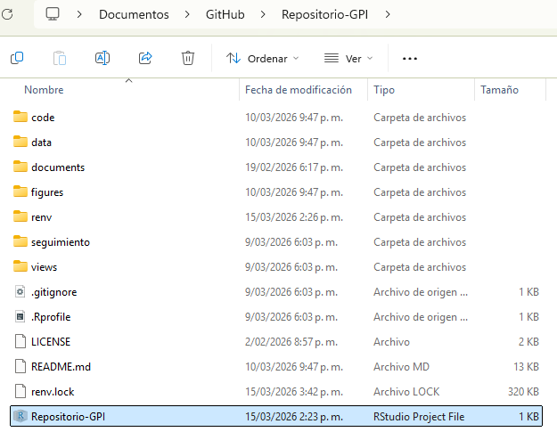

# Community Policing does not build citizen trust in police or reduce crime in the Global South
> **Proyecto de replicación - Gestión de proyectos de investigación y Ciencia abierta (2026-1)**

## 1. Paper Seleccionado
**Título original:** *"Community Policing does not build citizen trust in police or reduce crime in the Global South"*

**Contexto del Estudio:**
El artículo examina si la estrategia de "policía comunitaria" (patrullajes a pie, reuniones comunitarias y resolución de problemas) logra aumentar la confianza ciudadana, la cooperación o reducir el crimen. A través de seis experimentos de campo coordinados en Brasil, Colombia, Liberia, Pakistán, Filipinas y Uganda, cubriendo a unos 9 millones de personas, el estudio reporta efectos nulos en todos los contextos.

## 2. Equipo de Trabajo

| Integrantes | Rol Asignado |
|--------------|---------------|
| **Laura Díaz** | Project Manager: seguimiento del cronograma, organización de reuniones y control de calidad |
| **Vivian Cabanzo** | Coordinadora de identificación, descargas y preparación de datos. Control de consistencia en las variables |
| **Juan Esteban Díaz** | Ejecución del código, reproducción de modelos estadísticos y validación de resultados del artículo |
| **Fabián Vidal** | Mantenedor del Repositorio en GitHub (documentación, README) e integración de los avances |


## 3. Descripción General
El objetivo del proyecto es lograr la replicabilidad de los resultados presentados en el artículo seleccionado. En este repositorio van a estar contenidos los datos originales que proporcionan los autores como son: las encuestas anonimizadas a ciudadanos y entidades gubernamentales. Además, los códigos con el procesamiento de los datos con procedimientos como: limpieza, construcción de índices primarios, implementación de regresiones lineales, efectos fijos, gráficos y tablas, etc. El proyecto tiene como objetivo principal el poner en práctica los temas de organización adecuada de directorios, ciencia abierta y replicabilidad, por lo que todos los pasos y procedimientos van a estar alojados en este repositorio.

**Licencia:**
El repositorio opera bajo una licencia MIT que permite a cualquier persona pueda distribuir, modificar y usar comercialmente los códigos alojados aquí, sin embargo, estos deben nombrar a los autores y el software se entrega sin garantía alguna.

## 4. Estructura de Directorios y Flujo de Trabajo
En este repositorio vamos a aplicar el protocolo de documentación *Teaching Integrity in Empirical Research* (**TIER**) para la organización de archivos en investigación cuantitativa que facilite la replicabilidad del trabajo. 

* **`/data`**: contiene los archivos originales (Raw Data) y los datos procesados en la replicabilidad del trabajo. 
* **`/documents`**: documentación del proyecto y manuscrito final. 
* **`/renv`**: aseguramiento del entorno de trabajo y gestión de dependencias de R. 
* **`/scripts`**: códigos con todo el proceso computacional de la replicación, divididos en: 
  * **`/prep_scripts`**: scripts relacionados al procesamiento y limpieza para generar los datos procesados. 
  * **`/article_scripts`**: códigos utilizados específicamente para generar las tablas y gráficos del artículo. 
  * **`/helper_functions_and_themes`**: funciones auxiliares y estandarización de temas visuales para el proyecto. 
* **`/seguimiento`**: documentos de gestión del proyecto, incluyendo la Estructura de Desglose del Trabajo (EDT) de replicación. 
* **`/views`**: salidas finales de la replicación, tablas y Gráficos, que van a ser comparadas con los resultados del paper original.

A continuación se presenta la estructura exacta del repositorio:

```text
Repositorio-GPI/
├── .Rprofile                  # activa renv automáticamente
├── renv.lock                  # 141 paquetes congelados
├── renv/
│   ├── .gitignore             # ignora binarios pesados
│   ├── activate.R             # inicialización del entorno
│   └── settings.json          # configuración de renv
├── code/
│   ├── article_scripts/
│   │   ├── figure2.R          # script principal
│   │   ├── figure2-repro.R    # versión adaptada Windows
│   │   └── 0-mkiv-theme.R     # tema visual
│   ├── meta-analysis/
│   │   ├── 0-variable-labels.R   # Organizar labels
│   │   ├── 1-prep-estimates.R    # Preparación de estimadores
│   │   └── 2-meta-analysis.R     # Meta análisis
│   └── install-packages.R        # Paquetes necesarios
├── data/
│   ├── out/                   # Archivos necesarios para figura 2
│   │   ├── meta-estimates-main-hypotheses.RDS
│   │   └── meta-estimates-secondary-hypotheses.RDS
│   └── otros_archivos/        # resto de datos RDS
├── documents/                 # Documentación del proyecto y manuscrito final
├── figures/                   # Gráficos y visualizaciones generadas
├── seguimiento/
│   └── EDT.md                 # Estructura de Desglose del Trabajo
└── views/                     # Salidas finales de replicación y tablas comparativas
```

## 5. Requisitos Iniciales Identificados
Para poder realizar el proceso de replicabilidad del artículo seleccionado, necesitamos los siguientes requerimientos técnicos y de información:

* **Sistemas Operativos:** Windows 11, macOS Sequoia (15.2) o Ubuntu 24.04.4
* **Software:** The R project (4.5.2), RStudio (2026.01.0) como IDE y Overleaf como editor de texto para LaTeX.
* **Control de Versiones:** Git (2.53.0) y GitHub Desktop (3.5.4).
* **Acceso a Datos:** los datos originales están disponibles en *The Center for Open Science*, en específico en el Open Science Framework (OSF), para los seis países estudiados en el artículo y vienen en formatos csv y dta.


## 6. Requerimientos de Software (Librerías)

Para garantizar la reproducibilidad computacional del artículo original, se requiere la instalación de diversos paquetes en R. A continuación se detallan y clasifican según su propósito dentro del flujo de análisis:

| Nombre del Paquete | Función |
| :--- | :--- |
| **Manipulación y Limpieza de Datos** | |
| `tidyverse`, `dplyr` | Manipulación y limpieza de datos. |
| `fastDummies` | Creación de variables dummy. |
| `lubridate` | Manejo fechas. |
| `stdidx` | Estandarización de índices. |
| **Importación y Exportación de Archivos** | |
| `haven` | Importación de datos en formatos externos (Stata). |
| `readxl` | Importación de archivos de datos desde Excel (xlsx). |
| `foreign`, `readstata13` | Lectura de bases de datos de otros software estadísticos como dta. |
| **Estadística y Econometría** | |
| `lmtest` | Pruebas de diagnóstico para modelos lineales. |
| `metafor` | Realización de metanálisis y modelos de efectos. |
| `nnet` | Modelos de regresión logística multinomial. |
| `FNN`, `RANN` | Algoritmos de búsqueda de vecinos más cercanos. |
| `Hmisc` | Funciones misceláneas para análisis de datos y estadísticas. |
| **Diseño Experimental y Aleatorización** | |
| `DeclareDesign` | Diagnóstico y simulación de diseños de investigación. |
| `ri2` | Ejecución de inferencia de aleatorización. |
| `blockTools`, `randomizr`, `RItools`| Asignación aleatoria y bloqueo de tratamientos. |
| **Análisis de Datos Espaciales (GIS)** | |
| `sf`, `sp` | Manejo y análisis de datos geográficos. |
| `rgdal`, `readOGR` | Lectura y proyección de datos vectoriales y mapas. |
| `ogrDrivers`, `ogrInfo` | Exploración de controladores y metadatos espaciales. |
| **Visualización y Formateo de Tablas** | |
| `gt` | Generación de tablas de presentación de alta calidad. |
| `kableExtra` | Personalización avanzada de tablas profesionales. |
| `stargazer` | Exportación estructurada de tablas de regresión a LaTeX. |
| `patchwork` | Composición de múltiples gráficos en una sola imagen. |
| `showtext` | Gestión de fuentes y tipografía en gráficos. |
| `glue` | Formateo dinámico de cadenas de texto. |
| `colorout` | Personalización de colores en la salida de la consola. |


## 7. Localización y acceso de los datos procesados
Los microdatos procesados utilizados por los autores también son de acceso totalmente abierto. El repositorio oficial que contiene las encuestas anonimizadas y la documentación primaria puede ser consultado en el **Open Science Framework (OSF)** a través del siguiente enlace: [OSF - Community Policing Data](https://osf.io/2juyz/overview).

Para facilitar la ejecución de los códigos y garantizar la reproducibilidad autónoma de este proyecto, una copia estática de estas bases de datos (en formato `.RDS`) ha sido alojada directamente en este repositorio dentro del directorio `data/out`. 

## 8. Restauración del Entorno de Trabajo (`renv`)

Para poder garantizar la reproducibilidad exacta de los resultados y evitar conflictos de versiones, software o librerías, utilizamos el gestor de paquetes `renv`. 

El ambiente de R fue inicializado con `renv::init()` en la raíz del proyecto, lo que creó automáticamente los archivos `.Rprofile` y `renv/activate.R`. La instalación de los 31 paquetes requeridos (más sus dependencias, generando un total de 141 entradas) fue congelada mediante `renv::snapshot()` dentro del archivo `renv.lock`.

### 8.1. Arquitectura de Reproducibilidad (`renv`)

El proyecto de replicación incluye una infraestructura automatizada dividida en la raíz del repositorio y el directorio interno `/renv`:

**Archivos en la raíz del proyecto:**
* **`.Rprofile`**: Archivo oculto que R lee automáticamente al iniciar la sesión. Su función es disparar el script de activación antes de cargar cualquier otra configuración del usuario.
* **`renv.lock`**: Es el "inventario" principal. Un archivo en formato JSON que registra las versiones exactas, dependencias y los repositorios de origen de los 141 paquetes necesarios para ejecutar los *scripts* del proyecto.

**Archivos dentro del directorio `/renv`:**
* **`activate.R`**: es el motor de arranque del entorno. En case de que un usuario clone el repositorio y no tenga `renv` instalado en su máquina, este script se encarga de descargarlo y configurarlo en segundo plano, interceptando las rutas del sistema para que las librerías se instalen de forma aislada.
* **`.gitignore`**: archivo de control de versiones interno de `renv` cuya función es indicarle a Git que ignore la subcarpeta local donde se descargan los binarios pesados de los paquetes.
* **`settings.json`**: Archivo de configuración que guarda las preferencias específicas del entorno de `renv` para este proyecto.

## 9. Instrucciones de replicación

### 9.1. Clonación del repositorio
Para poder clonar este repositorio es necesario ejecutar el siguiente comando de Git:

```bash
git clone [https://github.com/fevidals/Repositorio-GPI.git](https://github.com/fevidals/Repositorio-GPI.git)
```

### 9.2. Apertura del proyecto en RStudio
Una vez clonado el repositorio, es necesario abrir el archivo *Repositorio-GPI.Rproj* ubicado al inicio del repositorio: 

<p align="center">
  
</p>

### 9.3. Restauración del entorno (renv)
Dentro de la carpeta de **code** abrimos el script *install-packages.R*, el cual instala todos las librerías requeridas para la replicación, también contiene la función *renv::snapshot()* que registra las versiones de los 141 paquetes instalados y guarda esta información en el archivo *renv.lock*.

### 9.4. Orden de ejecución del código

## 10. Estado de la Replicación y Hallazgos Metodológicos

Durante el desarrollo de este proyecto, identificamos una brecha significativa entre la disponibilidad de los datos (publicados en OSF) y su reproducibilidad computacional real:

* **Fallas desde los datos crudos:** La replicación directa desde las bases crudas (*Raw Data*) no resultó viable para cinco de los seis países (Brasil, Liberia, Pakistán, Filipinas y Uganda). Se detectaron ausencias de variables clave (como geolocalización o fechas) y errores en los tipos de datos que impidieron la ejecución de los *scripts* de limpieza. **Colombia fue el único caso que se pudo ejecutar y replicar exitosamente.**
* **Dependencia de datos intermedios:** Debido a los fallos mencionados, la reproducción de los resultados principales (como la Figura 2) dependió estrictamente del uso de los estimadores ya pre-procesados por los autores (`*-estimates.RDS`).
* **Limitaciones del Repositorio Original:** La ausencia de un archivo `README` original, la falta de gestión de dependencias (inexistencia de un `renv.lock` previo) y el uso de rutas absolutas atadas a tipografías de macOS, obligaron a nuestro equipo a refactorizar el código, integrar Google Fonts y construir toda la arquitectura de reproducibilidad documentada en este repositorio.

## 11. Referencias

* Blair, G., Weinstein, J. M., Christia, F., et al. (2021). *Community policing does not build citizen trust in police or reduce crime in the Global South*. Science, 374(6571), eabd3446. [https://doi.org/10.1126/science.abd3446](https://doi.org/10.1126/science.abd3446)
* Blair, G., Weinstein, J. M., Christia, F., et al. (2021). *Supplementary Materials for: Community policing does not build citizen trust in police or reduce crime in the Global South*. Science/AAAS. Disponible en: [OSF - Community Policing Data](https://osf.io/2juyz/overview)
